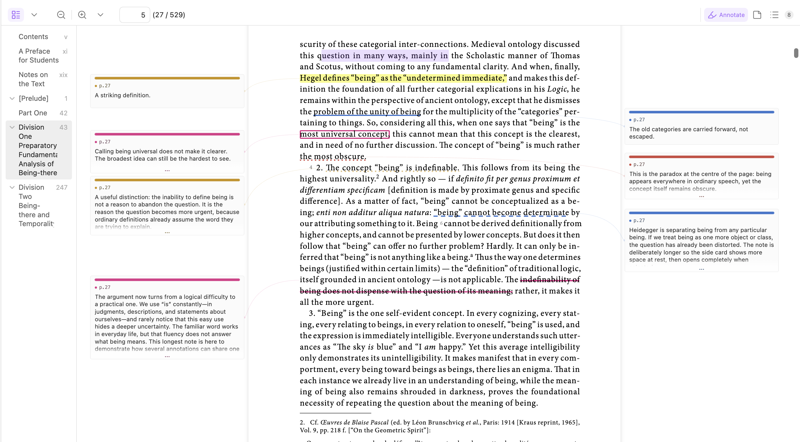
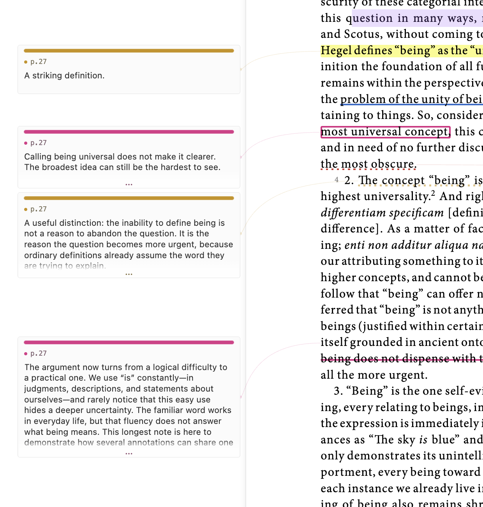
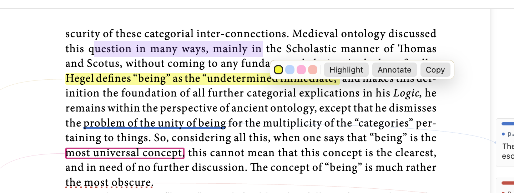
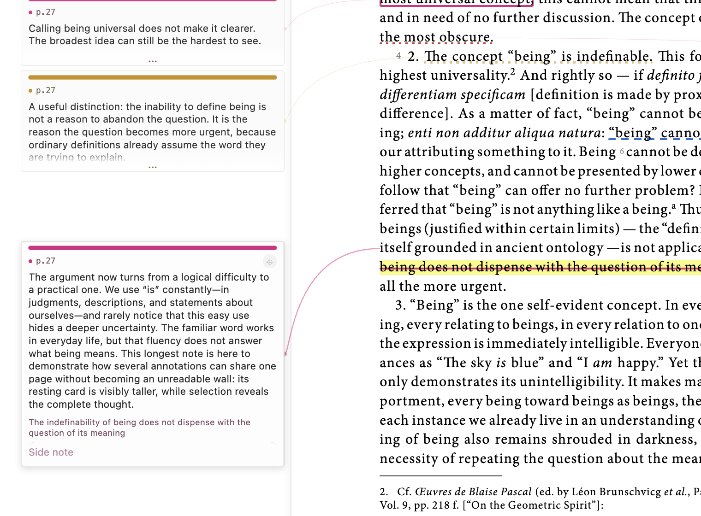
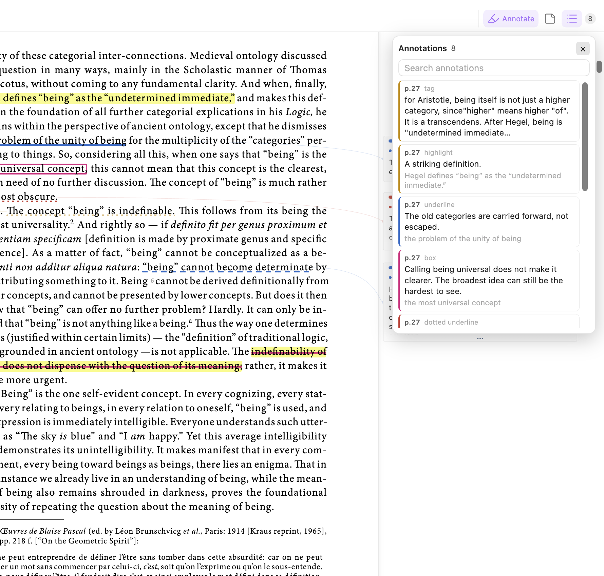
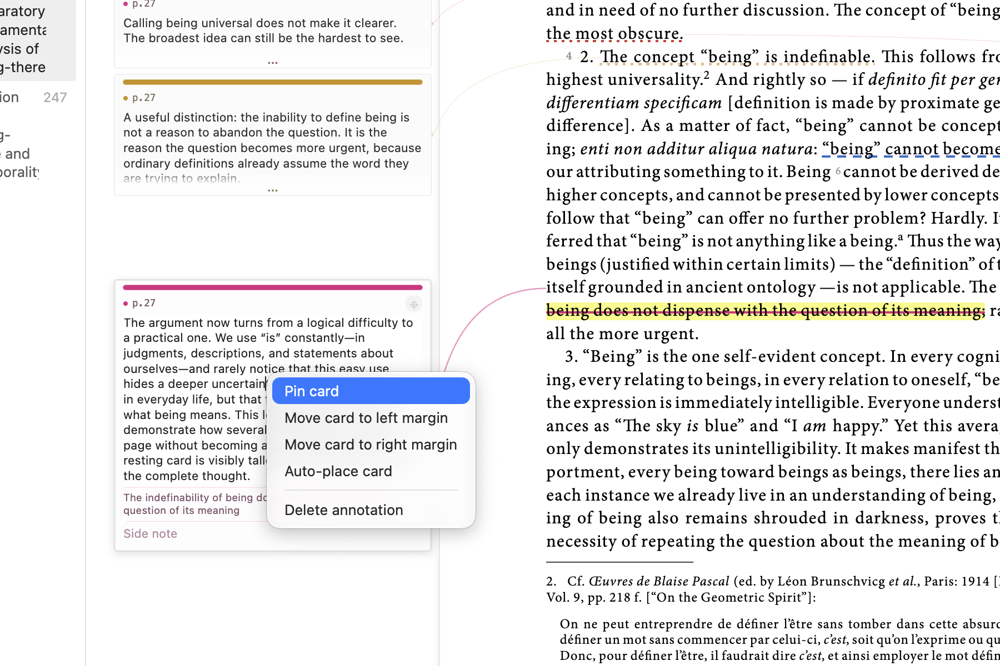

Original plugin:
# PDF Annotator

Read a PDF, mark the parts that matter, and keep your own thoughts beside the
words — all inside Obsidian.

Open any PDF and click **Annotate**. You can highlight a sentence, write a note,
and carry on reading without changing apps or opening a second document.



*Your notes stay close to the words they belong to.*

## See every note beside the page

Notes appear on the left or right of the page. A short note stays small. A long
note is taller, so you can tell how much you wrote before opening it.

When one page has many long notes, the cards fold just enough to share the
space. A soft fade and **…** show that more words are waiting. Point to a card or
click it to see the whole note.



*Different note lengths are easy to spot, and folded notes clearly show that
there is more to read.*

You do not need to guess how to make room for the cards. After you make a note,
or choose one from the note list, the PDF moves back just enough to show its
card. It stops as soon as the card has enough space.

## Mark what matters

Select some words and choose what you want to do:

- **Highlight** marks the words.
- **Annotate** marks the words and opens a place to write.
- **Copy** copies the selected words.



You can use a plain highlight, underline, dotted underline, dashed underline,
box, or strike-through. Four colours help different kinds of thought stand
apart.

## Open one note fully

Point to a note or click it and the card opens to show everything you wrote. A
long note is not cut off. Click the pin when you want a card to stay open.



*The selected note opens fully while the other cards stay out of the way.*

## Find a note again

Click the list button beside **Annotate** to see every mark and note in the PDF.
Search for a word, a page, or something you wrote. Click any result to go back
to its page and show its card.



## Put notes where you want them

Right-click any card to keep it open, move it to the left, move it to the right,
let PDF Annotator choose a side, or delete it.



*Moving a card never moves or changes the words you marked.*

## A simple reading routine

1. Open a PDF and click **Annotate**.
2. Select a useful sentence.
3. Choose **Highlight** or **Annotate**.
4. Write your thought.
5. Keep reading; your note stays beside the page.
6. Use the list when you want to find it again.

## 🚀 About this fork

* **Custom Annotation Icon:** Replaced the default colored square placeholder with the note emoji (`🗒️`) for all highlight annotations.
* **Custom Color Selector:** Added a customizable color picker (ranging from 1 to 5 colors) directly from the settings.
* **HTML \<mark> Tag Integration in Markdown Export (bundles.ts):** Configured the system so that all text highlights exported into the .annotations.md file are wrapped inside HTML \<mark style="background: [color];">...\</mark> tags. This ensures that when Obsidian renders the file, it applies the exact background color chosen by the user for that specific highlight.
Inline Note Inclusion Within the Tag: Updated the logic so that if a user writes a personal note associated with a highlight, it is rendered directly inside the same \<mark> block (placed right after the highlighted text, enclosed in parentheses, and formatted in italics: *(note: ...)*). This keeps the text and the note visually bound together under the same background color styling.
Dedicated Configuration Options: Added and integrated configuration settings within the plugin preferences to handle formatting behavior and wrapping with the \<mark> tag, ensuring the system consistently adheres to this structure during data synchronization and export.
* **Inline Note Inclusion in Markdown:** Updated the Markdown generation so that user-written notes (the `note` field) now appear directly on the same line as the annotation, placed right after the highlighted text, enclosed in parentheses, and formatted in italics (`*(note: ...)*`).
* **Spacing Between Annotations:** Added an automatic blank line between each annotation in the export file to significantly improve document readability and formatting.
* **TypeScript Build Bug Fixes:** Resolved missing type issues (implicit `any` types and path parameters) in `main.ts` and cleared non-standard space characters in `bundles.ts` to ensure a clean build and prevent module resolution errors.


---

## Technical Notes

PDF Annotator is a desktop-only Obsidian community plugin. It adds annotation
layers, controls, margin rails, and an annotation list to Obsidian's native PDF
viewer. Obsidian's existing toolbar, outline/sidebar, zoom controls, and page
navigation remain in place.

Selection alone does not create an annotation. The selection popover commits a
highlight or annotated mark only after the user chooses an action. Highlight
geometry is stored in PDF user-space coordinates, so marks stay anchored across
zoom and resize changes.

### Automatic rail space

Creating an annotation or selecting one from the annotation list activates its
card. If the native PDF page leaves too little readable margin, the plugin uses
the native zoom-out control until that card's rail is wide enough. It stops as
soon as the target rail is readable and has a bounded retry limit.

Resting card height is weighted mainly by user-written content. On a dense page,
the available rail height is shared proportionally: longer cards remain visibly
longer, while all resting cards fold enough to fit. Hovered, active, and pinned
cards expand to their full content height, with an internal scrollbar only when
the entire card is taller than the available viewport.

### Native PDF workflow

1. Open a PDF normally in Obsidian.
2. Click **Annotate** in the native PDF toolbar.
3. Select text and choose **Highlight**, **Annotate**, or **Copy**.
4. Click an existing mark to edit its style, colour, note, or side note.
5. Use a side card for in-place editing, or the annotation list for search and
   navigation.

The card context menu supports pin/unpin, left placement, right placement,
automatic placement, and deletion. Drag-and-drop between rails is not currently
implemented.

## Fallback Annotator View

The original bundled `pdf.js` annotator view remains available as a stable
fallback. Use the command palette action:

```text
Open current PDF in annotator
```

You can also make the fallback annotator the default PDF viewer from plugin
settings. This redirects ordinary `.pdf` clicks into PDF Annotator. The setting
is opt-in for fresh installs.

## Storage and Recovery

The visible PDF path is not the document identity. Identity comes from a SHA-256
hash of the PDF bytes, and the canonical vault-local bundle is stored at:

```text
.pdf-annotator/bundles/sha256/<hash>/
  document.pdf
  annotations.md
  annotations.previous.md
  manifest.json
```

`document.pdf` is a verified byte-for-byte recovery copy. `annotations.md` is
the canonical annotation sidecar, and `annotations.previous.md` is a rolling
last-known-good copy used if a save is interrupted or corrupted.
`manifest.json` records the current working path, previous path aliases,
checksum, original filename, timestamps, and PDF fingerprint. The working PDF
is never modified.

The bundle is created the first time annotation mode opens for that PDF. This
uses roughly one additional PDF's worth of vault storage in exchange for
deletion recovery.

Moving or renaming a working PDF does not move the bundle and cannot disconnect
its annotations. Replacing a PDF with different bytes at the same path creates a
different bundle, so annotations cannot silently attach to the wrong document.
Deleting the working copy leaves the bundle intact. Use **Restore a PDF from
annotation backup** in the command palette to verify the checksum and restore a
copy into `Recovered PDFs/`.

Existing central or same-folder `<pdf-name>.annotations.md` sidecars are
imported on first open. A unique PDF-fingerprint match can also recover a
sidecar that was already orphaned by a rename. Legacy files are retained as
recovery snapshots.

The canonical sidecar contains a readable Markdown summary and a fenced JSON
block that is used as the machine-readable source of truth. Use **Export
annotations for current PDF** to create a user-visible snapshot under
`PDF annotations/Exports/` (or the configured legacy annotation folder).

Use **Verify all PDF annotation backups** to checksum every managed recovery
copy. Backups are also verified when created and periodically when their PDFs
are opened. The managed library protects against moving, renaming, replacing,
or deleting a working copy; it is still part of the same vault, so the vault
itself should remain covered by iCloud, Obsidian Sync, or another backup system.
If your sync tool excludes hidden folders, explicitly include
`.pdf-annotator/`.

## Privacy

PDF Annotator does not use telemetry and does not send PDF contents or
annotation contents to any remote service. Data is stored locally in your vault.

## Legacy Import

If you previously used `obsidian-annotator`, open the target PDF in this plugin
and run:

```text
Import legacy obsidian-annotator highlights for this PDF
```

The importer searches notes with `annotation-target:` frontmatter, re-anchors
quoted text in the PDF, and creates PDF Annotator highlights. Legacy notes are
left untouched.

## Development

```bash
npm install
npm run typecheck
npm run build
```

`npm run build` type-checks the plugin, bundles `main.js`, and copies `main.js`,
`manifest.json`, and `styles.css` into the configured local vault plugin
directory used by this checkout.

Set `LOCAL_PDF_ANNOTATOR_PLUGIN_DIR` to build into a staging directory without
touching the installed Obsidian copy.

## Release Files

Obsidian installs community plugin releases from GitHub release assets. A
release must include:

- `main.js`
- `manifest.json`
- `styles.css`

The release tag must match the `version` field in `manifest.json`.
